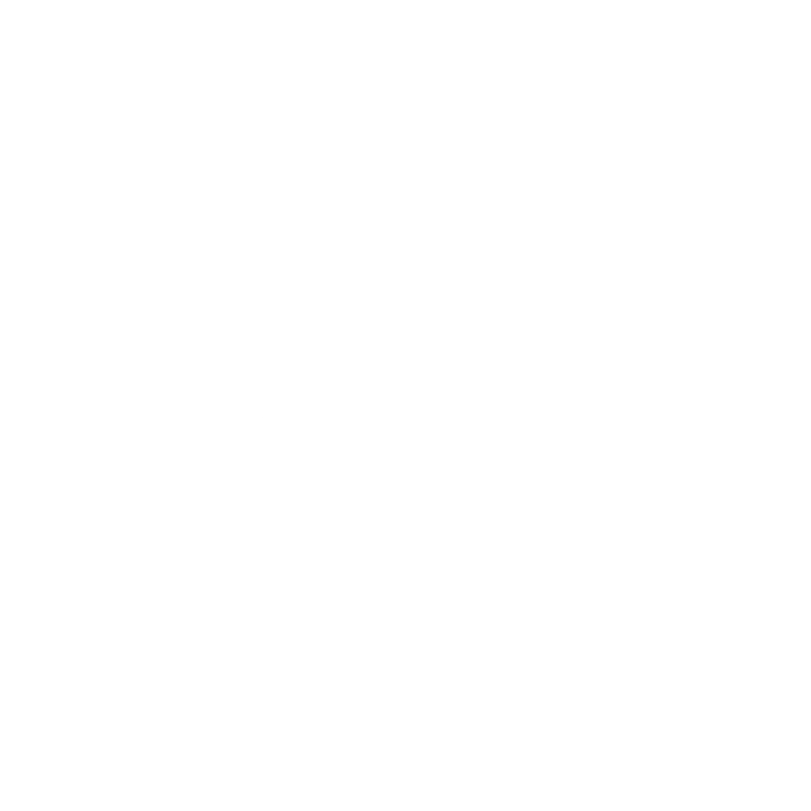
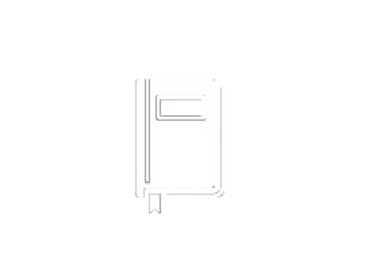

  <h1>The Last Of Us Concept Design
    
  </h1>
  
A visually driven website inspired in TLOU, where UI/UX design mirrors the energy and artistry of the game in the part II.

<h1>Overview of this project
    
</h1>
    <strong>Note:</strong> This is a static version of the website created to showcase the UI/UX design inspired by <em>The Last of Us Part II</em>. The original project was developed using PHP, CSS, and JavaScript, featuring full website functionality including database interactions and backend integration.

    <h1>Navigate The Website!</h1>
    
    
Take a look and dive into the world of <em>The Last of Us Part II</em> you'll find icons and elements inspired directly from the game! Creating the most accurate design required extra effort to overcome some inconsistencies, but thanks to over 80 hours of gameplay and achieving full platinum on PS4, the developer also a passionate fan worked hard to bring it to life.

    <h1>Autor: </h1>
        
<strong>Designed</strong> & <strong>developed</strong> by: <em>Alejandro ~ 알렉스</em>

